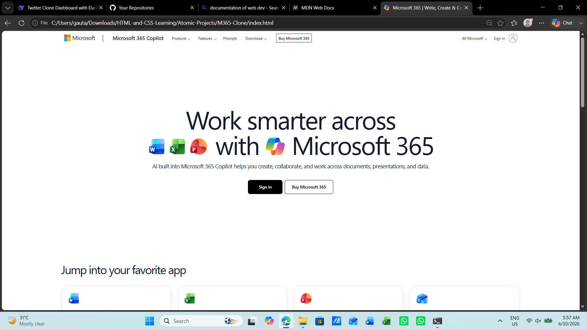
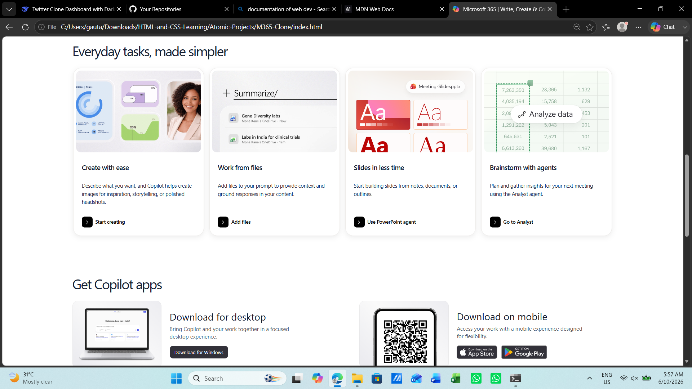
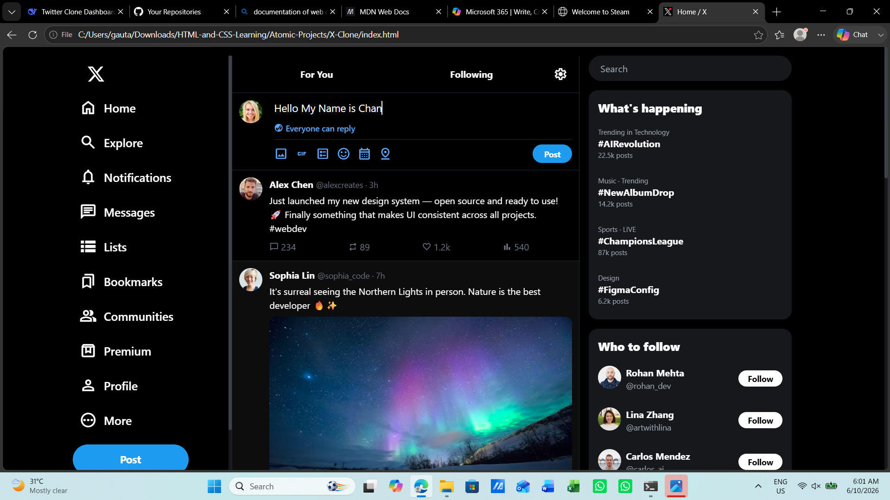
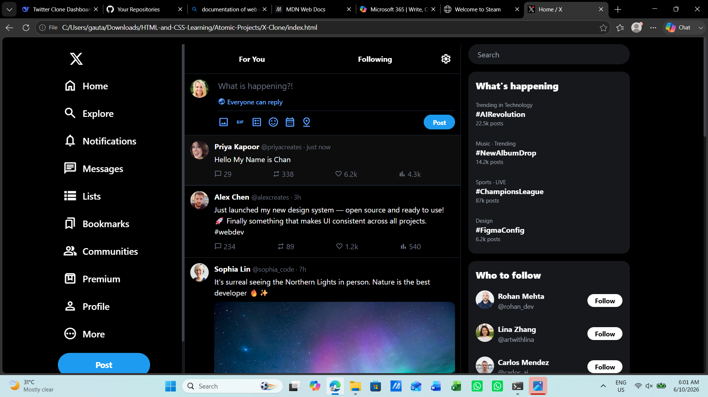
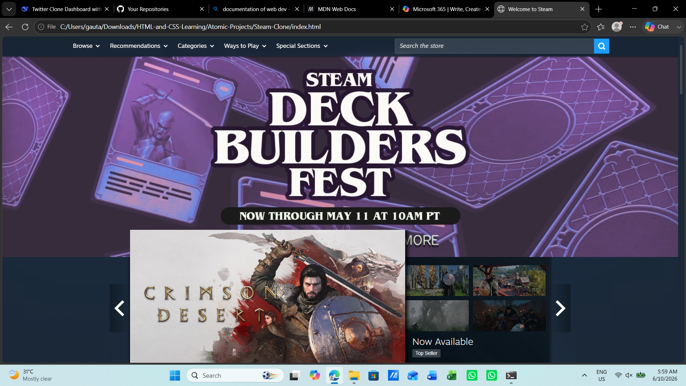
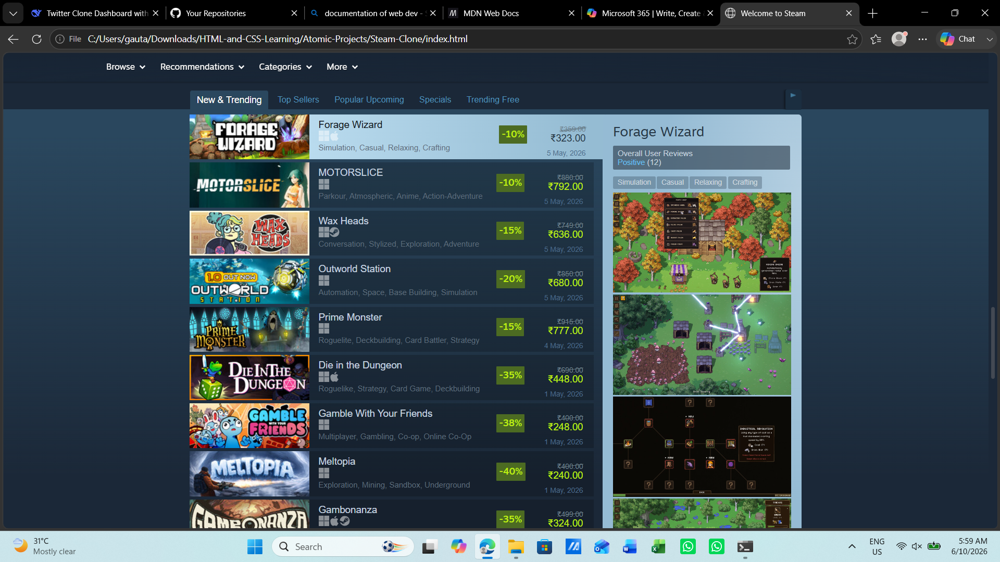

# 🎨 HTML-and-CSS-Learning 

---

<div align="center">
  
  
  
  <br/>
  <em>From semantic markup to modern layouts – master the building blocks of the web. This repository documents my journey of learning HTML, CSS, and modern styling frameworks like Tailwind CSS.
It contains tutorials, demonstrations, and atomic projects that showcase practical applications of web development concepts.</em>
</div>

---

## 📖 Table of Contents

- [ℹ️ About This Repository](#about-this-repository)
- [📁 Directory Structure](#-directory-structure)
- [🖼️ Featured Projects](#️-featured-projects)
  - [M365 Clone](#m365-clone)
  - [X.com (Twitter) Clone](#xcom-twitter-clone)
  - [Steam Clone](#steam-clone)
- [🛠️ Technologies & Tools](#️-technologies--tools)
- [🚀 How to Set Up](#-how-to-set-up)
  - [HTML & CSS Basics](#html--css-basics)
  - [Tailwind CSS](#tailwind-css)
- [🤝 Contributing](#-contributing)
- [📜 Conclusion](#-conclusion)

---

## About This Repository

> **Your complete guide to HTML, CSS, and Tailwind CSS – filled with tutorials, real‑world clones, and modern styling techniques.**

This repository is a structured learning path for front‑end styling. It includes:

- **HTML Tutorials** – semantics, forms, media, SEO, and obsolete tags.
- **CSS Tutorials** – from selectors, box model, flexbox, grid, to animations, transforms, filters, and responsive design.
- **Tailwind CSS Tutorial** – utility‑first workflow with configuration and build setup.
- **Three full‑page clones** – M365 (Microsoft 365), X.com (Twitter), and Steam – demonstrating practical application of all learned concepts.

Each folder contains standalone examples, ready to open in your browser, and the clones showcase how to replicate modern web interfaces.

---

## 📁 Directory Structure

```
html-css-learning-repo/
│
├── Atomic-Projects/                     # Full‑page clones (real‑world UI replication)
│   ├── M365-Clone/                      # Microsoft 365 landing page clone
│   ├── X.com-Clone/                     # Twitter (X) home page clone
│   └── Steam-Clone/                     # Steam store front clone
│
├── CSS-Tutorials/                       # 21 progressive CSS lessons (numbered)
│   ├── 1)_CSS_Injection_Methods
│   ├── 2)_CSS_Selectors_Showcase
│   ├── 3)_CSS_Box_Model_and_Margin_Collapse
│   ├── 4)_CSS_Fonts_Text_and_Color_Properties
│   ├── 5)_CSS_Cascading_Algorithmic_Laws
│   ├── 6)_CSS_Font_Size_Units
│   ├── 7)_CSS_Display_Property
│   ├── 8)_CSS_Shadows_and_Outlines
│   ├── 9)_CSS_Lists_Styling
│   ├── 10)_CSS_Overflow_Solutions
│   ├── 11)_CSS_Position_Property
│   ├── 12)_CSS_Variables
│   ├── 13)_CSS_Media_Queries
│   ├── 14)_CSS_Float_and_Clears
│   ├── 15)_CSS_Display_Flexbox
│   ├── 16)_CSS_Display_Grid
│   ├── 17)_CSS_Transform_Property
│   ├── 18)_CSS_Transition_Properties
│   ├── 19)_CSS_Animation_Properties_and_KeyFrame
│   ├── 20)_CSS_Object_Fit_and_Object_Position_Properties
│   └── 21)_CSS_Filter_Property
│
├── Demonstration/                       # Screenshots of the three clones
│   ├── M365-LowerMainPage.png
│   ├── M365-UpperMainPage.png
│   ├── Steam-LowerMainPage.png
│   ├── Steam-UpperMainPage.png
│   ├── X.com-AfterMessage.png
│   └── X.com-BeforeMessage.png
│
├── HTML-Tutorials/                      # Essential HTML concepts (6 lessons)
│   ├── 1)_Headings_Paragraph_and_Links
│   ├── 2)_Table_Image_and_Lists
│   ├── 3)_SEO_and_Core_Web_Vitals
│   ├── 4)_Forms_Label_and_Input_Tags
│   ├── 5)_Video_Audio_and_Media
│   └── 6)_Semantic_Tags_Obsolete_Tags_and_Quotation_Tags
│
├── Tailwind-CSS-Tutorial/               # Tailwind setup and usage
│   ├── src/
│   ├── index.html
│   ├── package-lock.json
│   ├── package.json
│   ├── setup.md
│   └── tailwind.config.js
│
├── .gitignore
└── README.md
```

---

## 🖼️ Featured Projects 

> Below are screenshots of the three complete clones built using only HTML and CSS (plus Tailwind where noted). Each clone mimics a well‑known website to demonstrate real‑world layout and styling skills.

### 🖥️ M365 Clone (Microsoft 365)
A faithful recreation of the Microsoft 365 landing page – responsive header, hero section, cards, and footer.

| Upper Section | Lower Section |
|---------------|----------------|
|  |  |

---

### 🐦 X.com (Twitter) Clone
Replicates the Twitter home feed interface – sidebar, post composer, and timeline.

| Before Message | After Message |
|----------------|---------------|
|  |  |

---

### 🎮 Steam Clone
Clone of the Steam game store homepage – navigation, featured games, carousel, and sections.

| Upper Section | Lower Section |
|---------------|----------------|
|  |  |

---

## 🛠️ Technologies & Tools

| Category          | Technologies                                                              |
|-------------------|---------------------------------------------------------------------------|
| **Markup**        | HTML5 (semantic tags, forms, media, iframes)                              |
| **Styling**       | CSS3 (Flexbox, Grid, animations, transitions, transforms, filters, variables, media queries) |
| **Utility CSS**   | Tailwind CSS (with custom config and build process)                       |
| **Tools**         | VS Code, Live Server, npm, PostCSS, Autoprefixer                          |

---

## 🚀 How to Set Up

### HTML & CSS Basics
1. Clone the repository.
2. Navigate to any tutorial folder (e.g., `HTML-Tutorials/1)_Headings_Paragraph_and_Links`).
3. Open the `.html` file directly in your browser – no build step required.
4. For CSS tutorials, open the corresponding HTML file (most include inline or linked CSS).

### Tailwind CSS
```bash
cd Tailwind-CSS-Tutorial/
npm install          # installs tailwindcss, postcss, autoprefixer
npm run build        # compiles src/input.css to dist/output.css
# Then open index.html (or serve with Live Server)
```

> Detailed Tailwind setup instructions are also available in `setup.md`.

---

## 🤝 Contributing

Contributions are welcome! You can:
- Improve existing tutorials (better explanations, new examples).
- Add more clones or mini‑projects.
- Fix responsive issues or browser compatibility.
- Enhance the Tailwind setup with additional plugins.

**Guidelines:**
- Keep the folder structure consistent.
- Write clean, commented CSS/HTML.
- Update this README when adding major features.

---

## 📜 Conclusion

This repository is a complete self‑paced course for mastering HTML, CSS, and Tailwind CSS. Starting from the very basics (headings, tables) to advanced layout techniques (flexbox, grid, animations) and finally building three polished clones of real‑world websites.

Whether you are a beginner taking your first steps in web development or an experienced developer looking for a quick reference, you will find value here. **Star ⭐ the repo** if it helps you, and feel free to use the code in your own projects.

---

<div align="center">
  <sub>Built with ❤️ and a lot of CSS grid. Keep styling, keep creating!</sub>
  <br/>
  <br/>
  
</div>